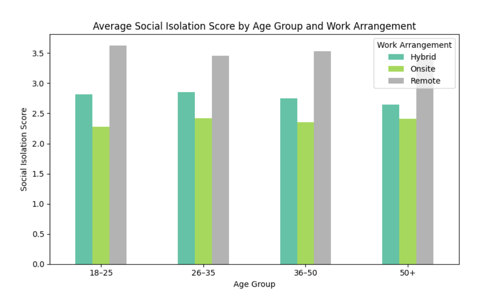

# Remote Work and Health – 2025 Survey Analysis

**Dataset:** Remote Work Health Impact Survey (2025)  
**Notebook on Kaggle:** [View here](https://lnkd.in/dufde7KB)  
**YouTube Video (Norwegian):** [Watch here](https://lnkd.in/dyj7Jfi8)

---

## 📌 Goal
To analyze how remote, hybrid, and onsite work arrangements in 2025 affect well-being, focusing on burnout, physical health, and social isolation.  

---

## 📊 Key Insights
1. **Burnout and work setup:**  
   Remote workers reported higher burnout than hybrid and onsite employees across job levels.  

2. **Burnout and working hours:**  
   No clear link found. Suggests burnout is influenced by more than just hours worked.  

3. **Industry differences:**  
   Tech, marketing, and healthcare showed higher burnout levels. Education reported the lowest.  

4. **Social isolation:**  
   Remote workers across all age groups reported higher isolation.  

5. **Physical health:**  
   Onsite and hybrid workers were slightly more likely to report *no issues*. Most people across all groups experienced some form of discomfort.  

---

## 🔧 Tools
- Python (Pandas, Matplotlib, Seaborn)  
- Jupyter Notebook  

---
## 🖼️ Visuals

### Burnout Proportion by Work Setup
  

---

### Burnout by Industry
  

---

### Average Isolation Score
  

